

## Qué es

## Lista de partes

| #  | Nombre de la pieza   [cantidad prevista] | Material/Tipo      |  Imagen de Referencia  |
| -- | ------------------------------------------- | ----------------- | -- |
| 1  | Arduino UNO [1]                           | Electrónica       | 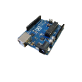|
| 2  | Adaptador AC/DC [1]                       | Electrónica       | |
| 3  | Cable Arduino USB [1]                     | Electrónica       | 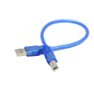|
| 4  | Protoboard [1]                            | Electrónica       | 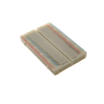|
| 5  | Servomotor [2]                            | Electrónica       | 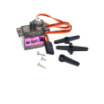|
| 6  | Motor Stepper [2]                         | Electrónica       | 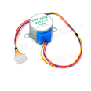|
| 7  | Motor DC con caja reductora [2]           | Electrónica       | |
| 8  | Driver Motor Stepper [2]                  | Electrónica       | 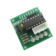|
| 9  | Puente H [1]                              | Electrónica       | 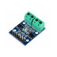|
| 10 | Interruptor fin de carrera [2]            | Electrónica       | 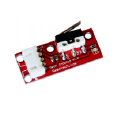|
| 11 | Regulador de Voltaje [1]                  | Electrónica       | 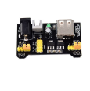|
| 12 | Cables Dupont (M-M) [20]                  | Electrónica       | 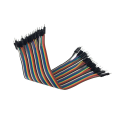|
| 13 | Cables Dupont (M-H) [20]                  | Electrónica       | |
| 14 | Cables Dupont (H-H) [20]                  | Electrónica       | 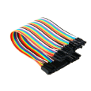|
| 15 | Base cuadrada 80x80mm [2]                 | MDF (madera)      | 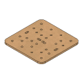|
| 16 | Soporte Motor Stepper [2]                 | MDF (madera)      | 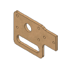|
| 17 | Soporte Polea Lisa [2]                    | MDF (madera)      | 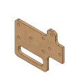|
| 18 | V-slot 250mm [1]                          | Aluminio extruido | 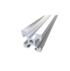|
| 19 | Correa GT2 700mm [1]                      | Caucho reforzado  | 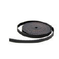|
| 20 | Patín [2]                                 | 3D print          | 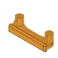|
| 21 | Polea Lisa [2]                            | 3D print          | 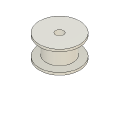|
| 22 | Polea Dentada [4]                         | 3D print          | 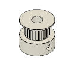|
| 23 | Acople Motor DC [2]                       | 3D print          | 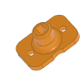|
| 24 | Sturdynators [2]                          | 3D print          | 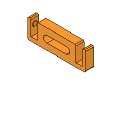|
| 25 | Brazos de T-Rex [2]                       | 3D print          | 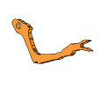|
| 26 | Adaptador Tuerca - V-slot [14]            | 3D print          | 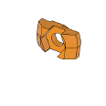|
| 27 | Espaciador 15mm [4]                       | 3D print          | 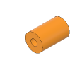|
| 28 | Espaciador Polea Lisa [4]                 | 3D print          | 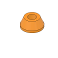|
| 29 | Espaciador 2mm [12]                       | 3D print          | 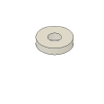|
| 30 | Espaciador OchO 1mm [2]                   | 3D print          | 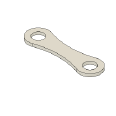|
| 31 | Sujetador para correa GT2 [3]             | 3D print          | 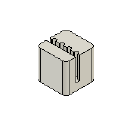|
| 32 | Perno Parker M3x10mm [14]                 | Acero Negro       | 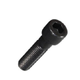|
| 33 | Perno Parker M3x20mm [6]                  | Acero Inoxidable  | 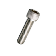|
| 34 | Perno Parker M3x25mm [6]                  | Acero Negro       | 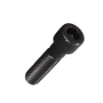|
| 35 | Perno Parker M3x30mm [4]                  | Acero Negro       | 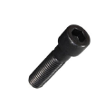|
| 36 | Golilla plana M3 [4]                      | Acero Zincado     | 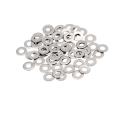|
| 37 | Tuercas M3 [24]                           | Acero Zincado     | 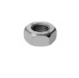|
| 38 | Llave Allen 2.5 [1]                       | Herramienta       | 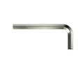|
| 39 | Ojos Locos [4]                            | Just Fun          | 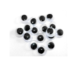|